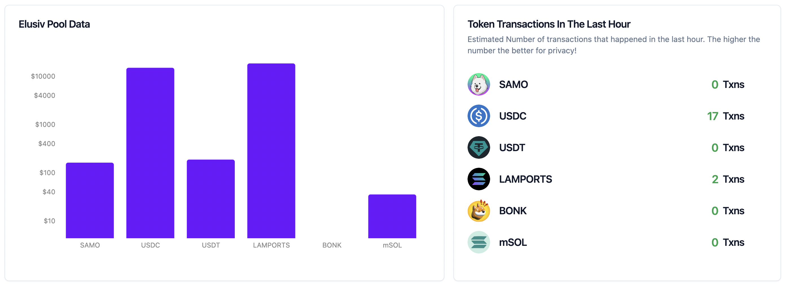
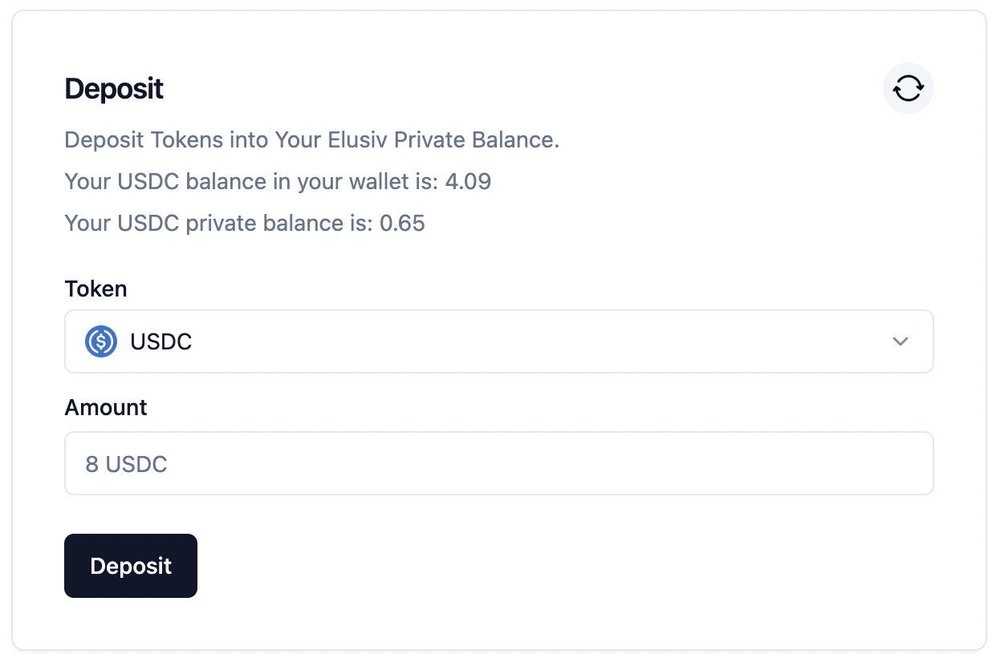
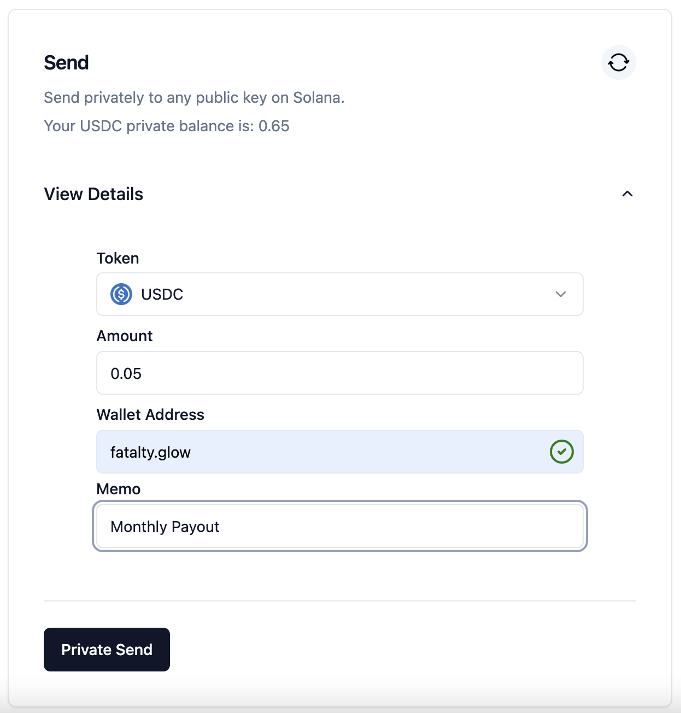
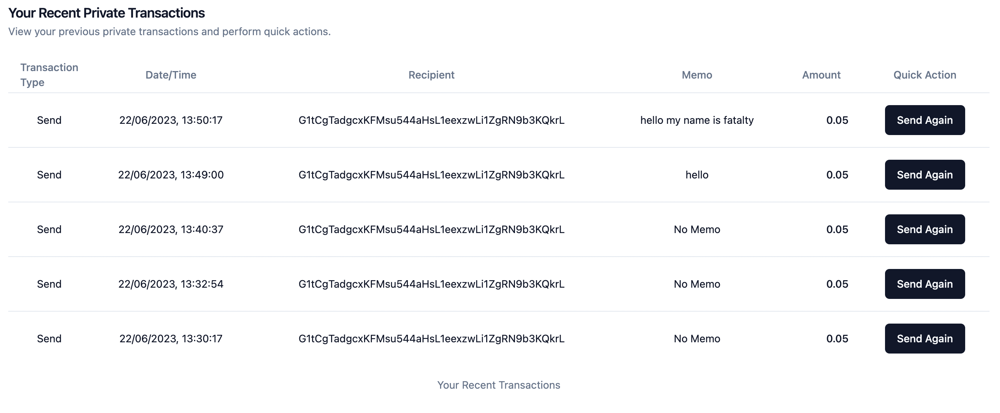
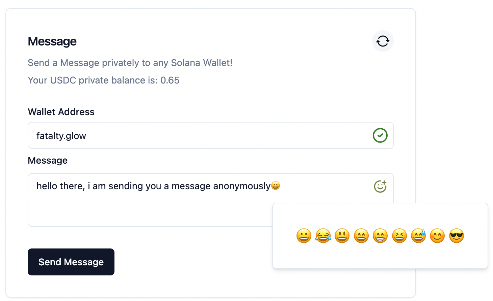

> 


# Elusiv-Simple-UI
Welcome to Elusiv-Simple-UI, a simplified rendition of Elusiv Privacy intended for general public use. With Elusiv-Simple-UI, interaction with Elusiv Privacy has been streamlined to deliver the easiest, most striaghtforward experience to users.

[Elusiv Simple UI](https://beta.monstre.net/)

### Table of Contents
#### Features
#### Usage
#### Credits

#### Features

1. Dashboard



Elusiv-Simple-UI showcases an aesthetically pleasing, up-to-date dashboard which presents real-time data from the Elusiv Privacy network. Data points include:

##### a. Pool Size in Tokens
##### b. Pool Size in USD

Estimated Transactions of Different Token Types in the Last Hour
The more transactions, the healthier the network!

2. Careful Wording
We're thoughtful in the terminology we use. Our interface does not use the term 'topups' but refers to them as 'deposits' into your private balance to more accurately represent the action taken.



3. Sending Features
Elusiv-Simple-UI enables users to send tokens to any wallet on the Solana network, or even to any name service. Special shoutout to Mikemaccana for the exceptional tooling. This includes, but is not limited to, services ending in **.sol, .glow, .backpack, .bonk,** and more.



4. Transaction History & Quick Actions
Track your full transaction history with our interface. Additionally, you can enjoy the Quick Actions feature, which parses your sends and recognisable send transactions based on memos. For instance, a send transaction with a memo "payout to Julian" allows you to perform a one-click send action, inspired by Amazon's one-click checkout. It's all about efficiency!



5. ZK Messaging
Stay anonymous with our Zero-Knowledge (ZK) messaging feature. Send messages anonymously to any Solana wallet with Elusiv-Simple-UI!



## Usage
To access these features, visit our beta website at [Elusiv Simple UI](https://beta.monstre.net/)

## Credits
This project wouldn't be possible without the original Elusiv Privacy project. We're also thankful to Mikemaccana for their awesome tooling.

[MikeMaccana](https://github.com/mikemaccana)
[Elusiv SDK](https://www.npmjs.com/package/@elusiv/sdk)
[shadcnUI](https://github.com/shadcn/ui)

## Is This Possible?
Absolutely! We're dedicated to bringing Elusiv Privacy to the general public in the simplest way possible.

For more information or queries, please raise an issue in this repository or reach out to the contributors. Happy transacting!

## License
This project is licensed under the terms of the MIT license.

## Getting Started

First, run the development server:

```bash
npm install

//then
npm run dev
# or
yarn dev
# or
pnpm dev
```

Open [http://localhost:3000](http://localhost:3000) with your browser to see the result.

You can start editing the page by modifying `pages/index.tsx`. The page auto-updates as you edit the file.

[API routes](https://nextjs.org/docs/api-routes/introduction) can be accessed on [http://localhost:3000/api/hello](http://localhost:3000/api/hello). This endpoint can be edited in `pages/api/hello.ts`.

The `pages/api` directory is mapped to `/api/*`. Files in this directory are treated as [API routes](https://nextjs.org/docs/api-routes/introduction) instead of React pages.